## FinTech Threat Monitoring & Suspicious Transaction Investigation

---
## Project Overview

This project demonstrates the use of Splunk Enterprise as a Security Information and Event Management (SIEM) platform to investigate suspicious financial transactions and identify indicators of fraudulent activity within a simulated FinTech environment.

The investigation focuses on detecting suspicious IP addresses, phishing-related account compromise, transaction structuring, and coordinated attack behavior through SPL queries and interactive dashboards.

---

## Objectives

- Investigate suspicious transaction activities.
- Detect indicators of financial fraud.
- Identify suspicious IP addresses.
- Monitor high-risk users.
- Visualize security events using Splunk dashboards.
- Perform threat hunting using SPL queries.

---

## Tools Used

- Splunk Enterprise
- Kali Linux
- Oracle VirtualBox
- Search Processing Language (SPL)
- CSV Transaction Dataset

---

## Lab Environment

| Component	         |          Technology |
|--------------------|---------------------|
| Operating System	 |          Kali Linux |
| SIEM Platform	     |          Splunk Enterprise |
| Virtualization	   |          Oracle VirtualBox |
| Dataset            |          CSV Transaction Logs |

---

## Dataset Overview

The dataset includes transaction records containing:

- User ID
- IP Address
- Device ID
- Transaction Type
- Transaction Status
- Timestamp
- Threat Flags
- Analyst Notes

---

## Dashboard Features

The Splunk dashboard provides visualizations for:

- Attack Category Distribution
- Transaction Type Distribution
- Top 10 Active Users
- Suspicious IP Addresses
- Threat Activity Timeline
- Threat Type Analysis
- Top High-Risk Users
- Repeated Suspicious IP Activity
- Transaction Status Overview

---

## Key Findings

The investigation identified:

- Possible transaction structuring below reporting thresholds.
- Repeated suspicious IP addresses.
- Indicators of phishing-related account compromise.
- Coordinated Midnight Swap attack activity.
- High-risk users requiring further investigation.

---

## Skills Demonstrated

- SIEM Monitoring
- Threat Hunting
- SPL Query Development
- Fraud Detection
- Log Analysis
- Dashboard Visualization
- Detection Engineering
- Incident Investigation
- Threat Correlation
- SOC Reporting

---

## Recommendations

- Configure real-time alerts for suspicious activities.
- Enable Multi-Factor Authentication (MFA).
- Investigate repeated suspicious IP addresses.
- Monitor high-risk users continuously.
- Improve transaction monitoring rules.
- Update SPL detections to identify emerging attack techniques.

---

## Dashboard Screenshots

### Dashboard Overview (1)
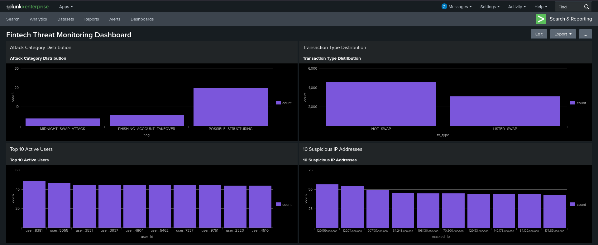

### Dashboard Overview (2)
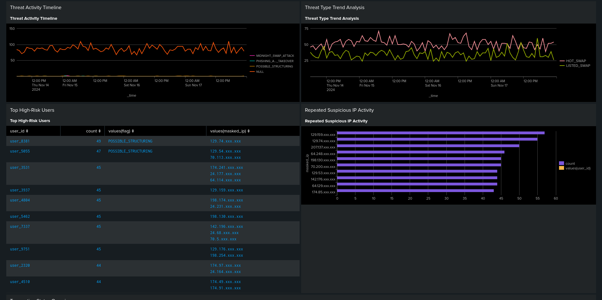

### Dashboard Overview (3)
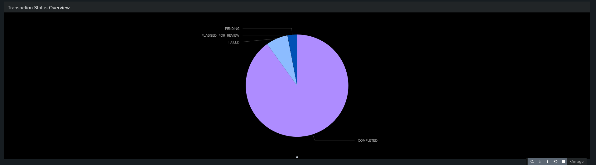

---

## SPL Queries

Below are the representative SPL queries used to build the dashboard visualization and support threat hunting activities.

### Attack Category Distribution
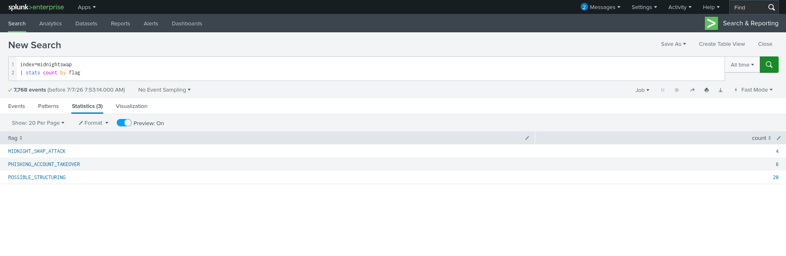

### Transaction Type Distribution
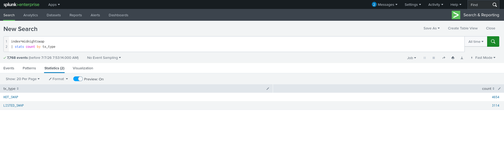

### Top Active Users
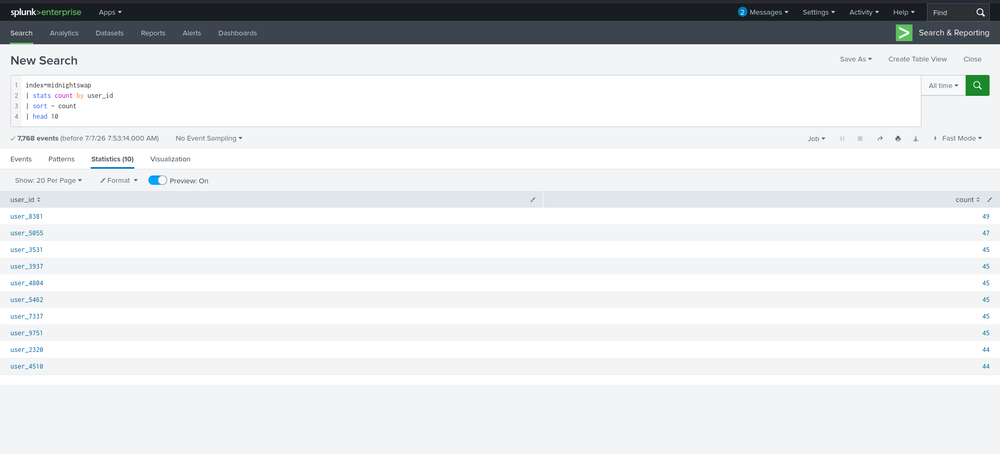

### Suspicious IP Addresses
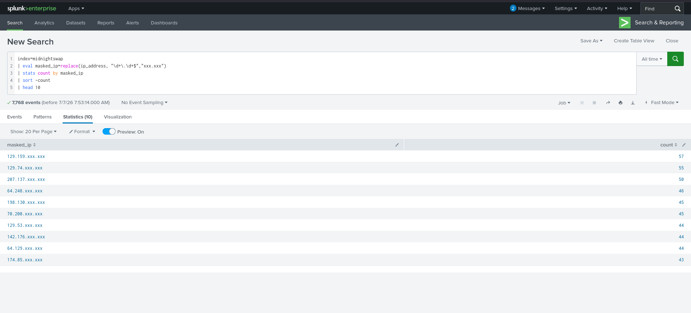

### Threat Activity Timeline
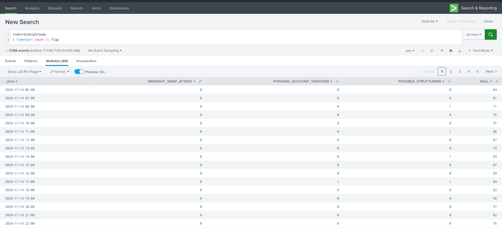

### Threat Type Analysis
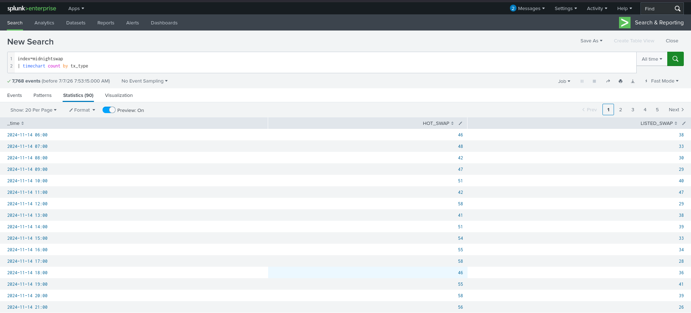

### Top High-Risk Users
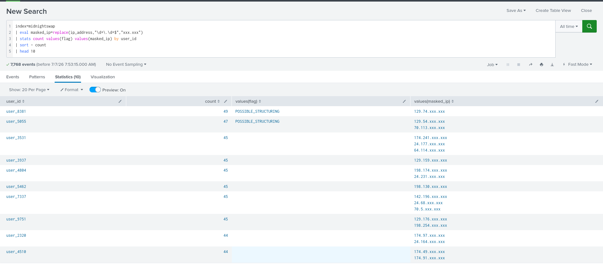

### Repeated Suspicious IP Activity
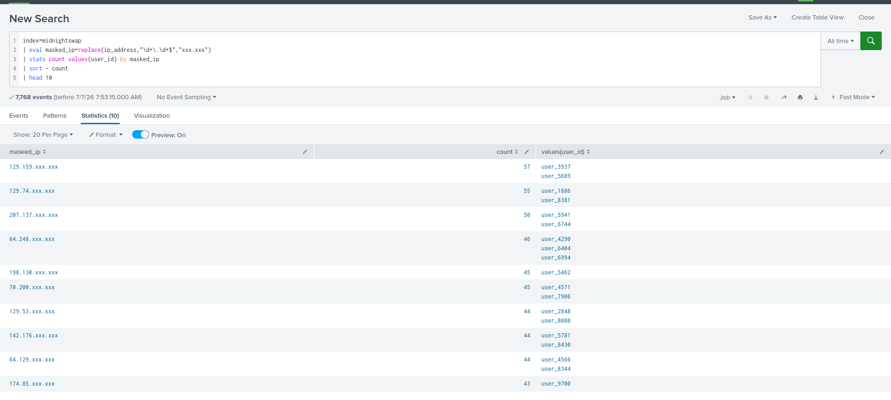

### Trasaction Status Overview
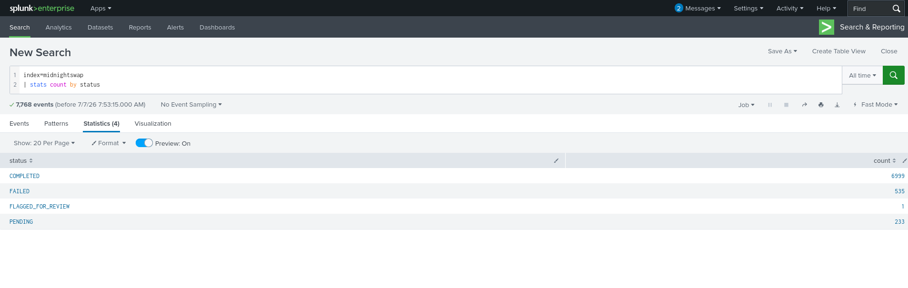

---

## Repository Structure

```text
FinTech-Threat-Monitoring-Splunk/
│
├── README.md
└── Screenshots/
    ├── dashboard-overview-1.png
    ├── dashboard-overview-2.png
    ├── dashboard-overview-3.png
    ├── spl-attack-category-distribution.png
    ├── spl-transaction-type-distribution.png
    ├── spl-top-active-users.png
    ├── spl-suspicious-ip-addresses.png
    ├── spl-threat-activity-timeline.png
    ├── spl-threat-type-analysis.png
    ├── spl-top-high-risk-users.png
    ├── spl-repeated-suspicious-ip-activity.png
    └── spl-transaction-status-overview.png

```

## Conclusion

This project demonstrates how Splunk Enterprise can be used to investigate suspicious financial transactions, identify fraud indicators, and support security operations within a simulated FinTech environment.

Through dashboard visualizations, SPL queries, and threat hunting techniques, the investigation highlighted suspicious IP activity, phishing-related account compromise, transaction structuring, and high-risk user behavior. The project reinforces practical SIEM investigation skills and demonstrates the value of data-driven security monitoring and incident analysis.

---

## Future Improvements

- Integrate additional threat intelligence feeds.
- Automate alerting for critical threats.
- Expand detection rules to cover more attack scenarios.
- Develop advanced risk scoring for users and transactions.

---

## Acknowledgements

This project was developed as part of my cybersecurity learning journey to strengthen my practical skills in SIEM monitoring, threat hunting, SPL query development, and security investigations using Splunk Enterprise.

Special appreciation to the cybersecurity learning resources, labs, and mentors that provided guidance and hands-on experience throughout the development of this project.

---
## Author

Ademuyiwa Yinus

Aspiring SOC Analyst | SIEM | Splunk | Threat Hunting | Cybersecurity
